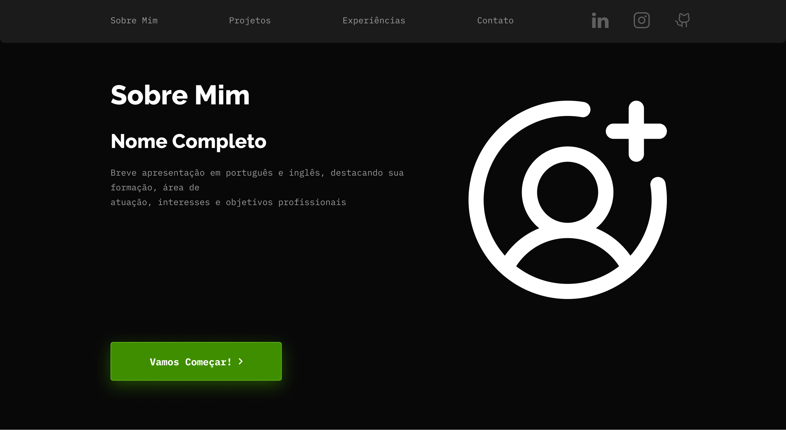
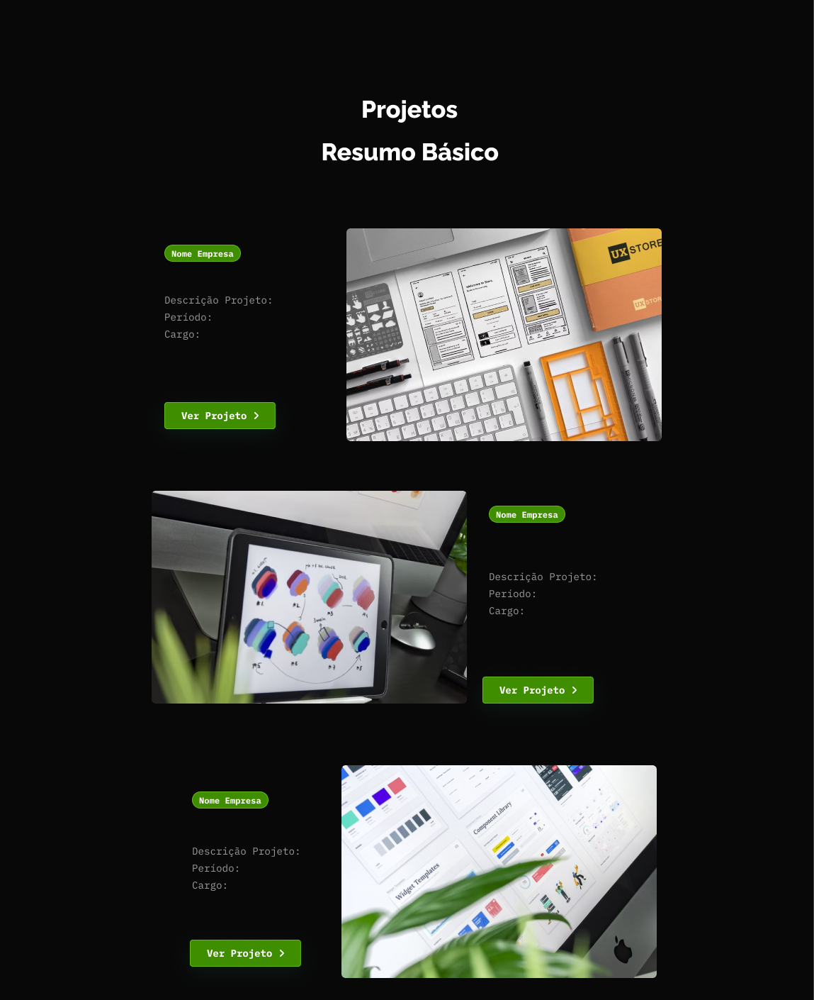
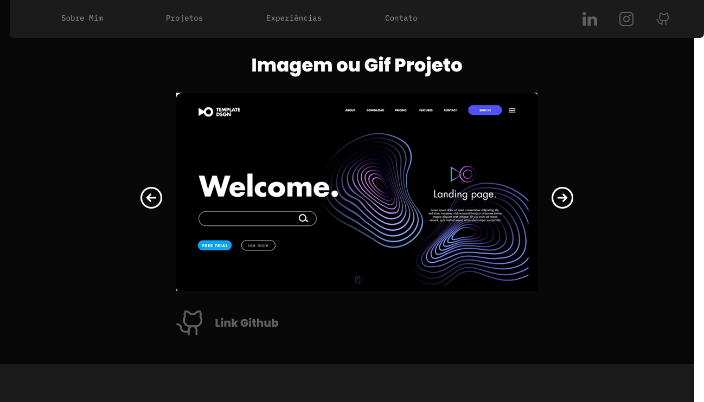
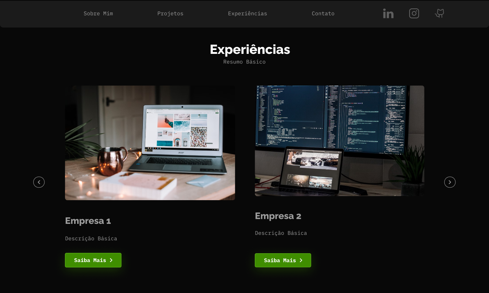
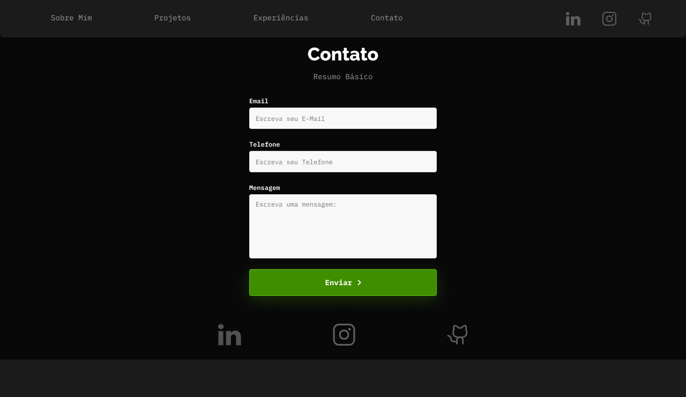

# 🚀 Portfólio Pessoal

> *Portfólio interativo para apresentação de projetos, habilidades e contatos*

---

## 📌 Descrição do Projeto

Este projeto consiste no desenvolvimento do meu portfólio web pessoal. O objetivo principal é centralizar meus principais projetos, demonstrar minhas habilidades técnicas em desenvolvimento e oferecer uma forma rápida e direta para recrutadores e clientes entrarem em contato comigo.

* **Objetivo:** Apresentar meus projetos e habilidades de forma profissional e visualmente atraente.
* **Público-alvo:** Recrutadores, desenvolvedores e potenciais clientes.

---

## 🎨 Protótipos

Aqui estão as imagens das telas e do fluxo da aplicação:

### 📱 Layout / Telas






> 🔗 **Link do Figma:** [Clique aqui para acessar o protótipo interativo](https://www.figma.com/design/e4Malif4A6em6Vo9LXrWvZ/Untitled?node-id=0-1&t=ovZkXaLwx31QkIAU-1)

---

## 🗺️ Estrutura do Site (Navegação)

O menu de navegação dará acesso às seguintes seções, conforme especificado no laboratório:

* **Sobre Mim** — apresentação em português e inglês, com formação, área de atuação, interesses e objetivos profissionais.
* **Projetos** — linha do tempo de projetos (do mais antigo ao mais recente), com nome, descrição, tecnologias, link do repositório e imagem/GIF de cada projeto.
* **Experiências** — histórico profissional, estágios, freelas e participações em projetos open source ou eventos técnicos.
* **Contato** — ícones clicáveis (e-mail, WhatsApp, LinkedIn) e formulário de contato (nome, e-mail e mensagem).

---

## 🛠️ Tecnologias Previstas

* **Front-end:** React, JavaScript, HTML5, CSS3
* **Navegação:** React Router (`react-router-dom`)
* **Back-end:** —
* **Design & UX:** Figma
* **Versionamento:** Git e GitHub
* **Hospedagem (prevista):** Vercel

---

## 📦 Dependências e Bibliotecas

| Pacote | Uso |
|---|---|
| `react`, `react-dom` | biblioteca de construção da interface |
| `react-router-dom` | navegação entre as páginas (SPA) |
| `vite` | ambiente de desenvolvimento e build |

> Lista será atualizada conforme novas bibliotecas forem adicionadas ao projeto.

---

## 📁 Estrutura de Pastas

- **public/** — arquivos estáticos que não passam por processamento (ícones, favicon, imagens fixas)
- **src/assets/** — imagens e ícones usados dentro dos componentes
- **src/components/** — componentes reutilizáveis
- **src/pages/** — páginas/rotas da aplicação
- **src/styles/** — arquivos de estilo (CSS, SCSS, etc.)
- **index.html** — ponto de entrada da aplicação (usado pelo Vite)

---

## ▶️ Como Executar Localmente

Pré-requisitos: [Node.js](https://nodejs.org/) 18+ e npm.

```bash
# instalar dependências
npm install

# rodar em modo desenvolvimento
npm run dev
```

O projeto ficará disponível em `http://localhost:5173`.

---

## 🌐 Site Publicado

`(link será adicionado após o deploy — Lab01S03)`